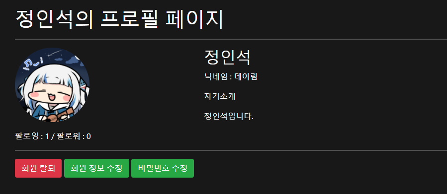
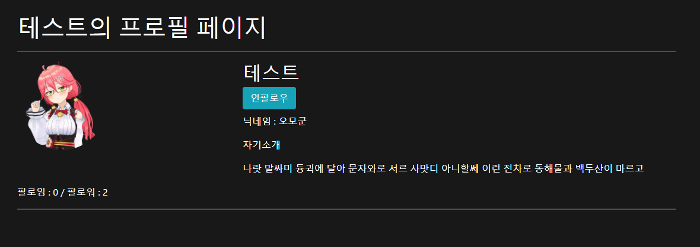
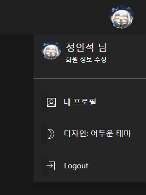
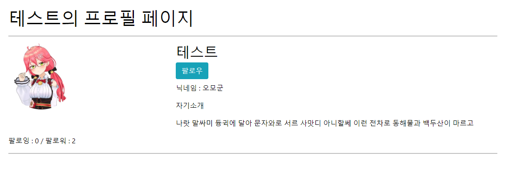
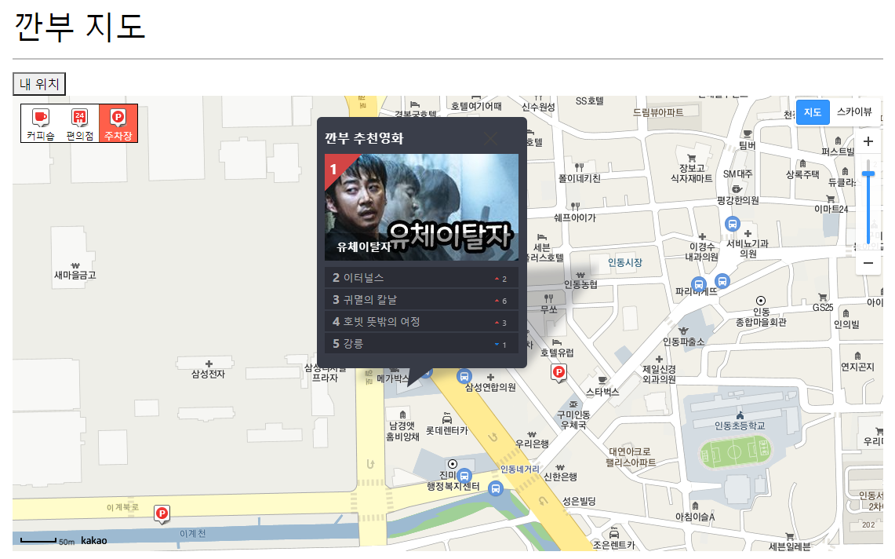
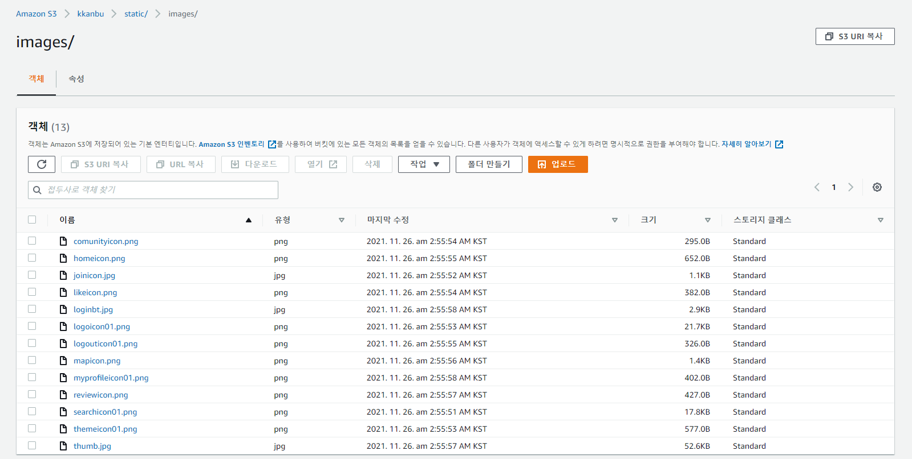

# Project Name : Kkanbu Movie (깐부 무비)


## 1. 개요 (概要)

개발환경 (開発環境)：Visual Studio Code、Python、Django

데이터베이스(DB) : SQLite

배포 (Deploy) : AWS ( Cloud9, S3 )

기능 (機能) : 카카오 지도 API 활용한 영화관 주변 맛집 및 주차장 안내, 추천영화 조회, 영화 정보 상세보기 (Youtube API 활용한 예고편 재생), 프로필 업데이트, 팔로우 기능, 댓글, 게시판

KAKAO地図APIを活用した劇場周辺の店や駐車場案内、おすすめ映画を見る、映画情報（YoutubeAPIで予告編再生）、プロフィール機能，コメント機能など


## 2. 목표 서비스（目標サービス）

계정（アカウント）

- 회원가입, 탈퇴와 로그인, 로그아웃（ログイン、ログアウト、アカウント登録）
- 프로필이미지 추가（プロフィール追加）
- 개인정보 수정（アカウント設定）
- 유저 팔로우 기능과 거기에 연동되는 부가기능（フォロー機能）

영화정보（映画情報）

- 메인 화면에서 다른페이지로 이동할 패널생성（List配置）
- 영화제목으로 검색하여 상세정보 조회（検索機能）
- 추천영화 카테고리 생성（おすすめ機能）
- 상세정보에서 예고편 미리보기 기능（YoutubeAPIで予告編）

추가기능（追加機能）

- 영화에 대한 평점과 후기를 남길수 있는 게시판 생성（コメント機能）

- 현재 위치를 이용하여 영화관의 위치와 편의시설 위치 조회（地図API）

- 게시판의 유용한 글에 추천을 남기기（いいね！機能）

  

## 3. 데이터베이스 모델링（DB Modeling）


## 4. 필수 기능에 대한 설명（機能説明）

### 4-1 메인화면（ホームページ）


- 메인 화면에서 지금까지 영화중 평점이 제일 높은 명작들을 소개
- 오른쪽 위의 버튼으로 로그인과 회원가입 가능

### 4-2 영화추천（映画おすすめ）


- 로그인을 한 후에 추천영화 탭을 들어가면 영화3개를 랜덤하게 추천
- 현재 인기가 많은 영화들중 3을 랜덤으로 선택

### 4-3 커뮤니티（コミュニティー）


- 로그인 해야만 글 생성가능
- 작성자만 수정, 삭제가 가능


### 4-4 계정 프로필  （アカウント）





- 자신의 프로필 페이지에서만 회원탈퇴, 회원정보 수정, 비밀번호 수정이 보이고 접근이 가능
- 다른 사람의 프로필로 들어가면 팔로우 / 언팔로우 기능이 존재


### 4-5 부가기능 （追加機能）





- 디자인 테마 변경을 통한 시각효과 변경（テーマ変更）




- 영화관의 위치가 표시된 지도와 추천영화를 보여주고 주변 편의시설을 표시해주는 지도서비스


## 5. 배포서버 URL（配信URL）

http://54.146.25.88:8000/movies/

AWS를 무료로 이용하고 있어 항상 열려있지는 않습니다.

AWSサーバーが無料なのでいつも接近できるわけではありません


## 6. 느낀점

비슷한 기능을 저는 JS 를 이용하여 구현하고 팀원은 views.py에서 구현하는 것을 봤는데 이런 방법도 있구나 하면서 잘 배웠습니다. 


이번 프로젝트를 진행하며 카카오지도 API도 사용해보고 계정관리, 게시판을 구현하였고 

기존 관통프로젝트에서 크게 신경쓰지 않았던 디자인에 관한부분도 신경쓰면서 배치와 css 코드의 어려움을 다시금 느꼈습니다. 


깃 브런치를 통한 분할 작업은 처음이라 재미있었습니다. 


AWS를 이용하여 배포하려는데 

깃 랩 Username과 Password를 몰라서 깃허브로 깃클론 했습니다. 

pip install gunicorn 하고

gunicorn --bind 0.0.0.0:8000 {프로젝트폴터}.wsgi:application

gunicorn --bind 0.0.0.0:8000 config.wsgi:application

gunicorn 설명에는 프로젝트폴더라고 하는데 그냥 wsgi.py 있는 폴더를 지정해주면 되는거였습니다. 


어떻게든 배포는 하였지만  icon과 이미지가 나오지 않는다.

거기에 프로필 이미지를 넣으려하면 PermissionError 가 나온다.

 S3 에 이미지 넣고 

```
AWS_ACCESS_KEY_ID = '엑세시 키'
AWS_SECRET_ACCESS_KEY = '시크릿 엑세스 키'
AWS_REGION = 'ap-northeast-2 리전 이름 '
AWS_STORAGE_BUCKET_NAME = '버킷이름'
AWS_S3_CUSTOM_DOMAIN = '%s.s3.%s.amazonaws.com' % (AWS_STORAGE_BUCKET_NAME,AWS_REGION)
AWS_S3_OBJECT_PARAMETERS = {
    'CacheControl':'max-age=86400',
}


AWS_DEFAULT_ACL = 'public-read'
AWS_LOCATION = 'static'
STATIC_URL = 'https://%s/%s/' % (AWS_S3_CUSTOM_DOMAIN, AWS_LOCATION)
STATICFILES_STORAGE = 'storages.backends.s3boto3.S3Boto3Storage'
STATICFILES_DIRS = [
    BASE_DIR / 'static'
] 

MEDIA_URL = "https://%s/" % AWS_S3_CUSTOM_DOMAIN
DEFAULT_FILE_STORAGE = 'storages.backends.s3boto.S3BotoStorage'
```




객체 URL을 통한 접근으로 이미지 출력은 된다. 

왜 안되는걸까 

```python

아이콘이 보임

아이콘이 안보임
```


코드를 하나하나 바꾸면 이미지가 모두 정상 출력은 되지만 load static 기능이 왜 적용되지 않는지 궁금했다.

```
STATIC_URL = 'https://%s/%s/' % (AWS_S3_CUSTOM_DOMAIN, AWS_LOCATION) 

https://%s/%s/
https://kkanbu.s3.ap-northeast-2.amazonaws.com/%s/
https://kkanbu.s3.ap-northeast-2.amazonaws.com/static/

 이 예전 STATIC_URL 을 가져오는것이 아니었나? 
/static/images/likeicon.png 를 예전 프로젝트에서 실행해보면 이미지가 잘 나온다. 
```


놀랍게도 포기하고 시간이 오래지난 뒤

시간이 지나고 

Connection in use: ('0.0.0.0', 8000) 라는 에러가 나왔고 실행이 안되어서


```python
sudo fuser -k 8000/tcp
```


포트를 죽인다음에 다시 서버를 실행했더니 이미지가 잘 불러와진다. 

그러나 프로필 파일은 여전히 먹통이다.


해결해 볼 것 : 프로필 파일 업로드 안 되는 거 해결해보기 

```
템플릿
<input type="file" name="file_upload">
불러올 때
request.FILES['file_upload']

```


참고 

https://testdriven.io/blog/storing-django-static-and-media-files-on-amazon-s3/

https://blog.myungseokang.dev/posts/django-use-s3/


