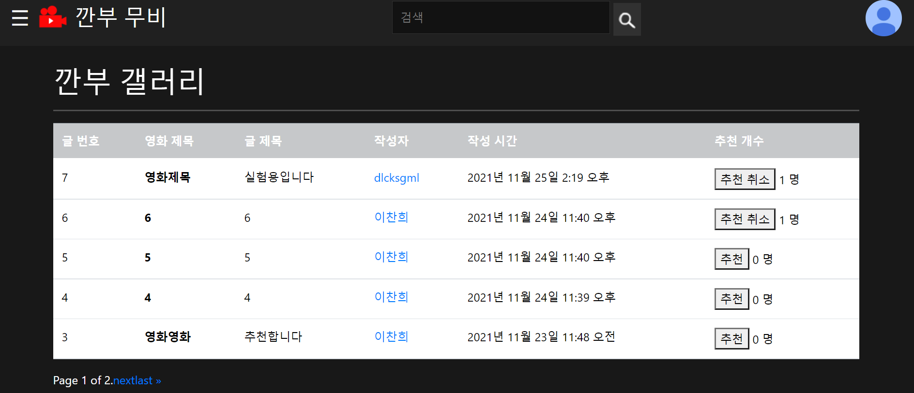

# movie-project

## 1. 구성원

조장 : 이찬희

- 영화 데이터의 활용
- 각 페이지의 기본기능과 화면 구성

조원 : 정인석

- 지도 api데이터 활용
- 세부 ui등과 계정관련 서비스구현

## 2. 목표 서비스 및 구현정도

계정

- 회원가입, 탈퇴와 로그인, 로그아웃
- 프로필이미지 추가
- 개인정보 수정
- 유저 팔로우 기능과 거기에 연동되는 부가기능

영화정보

- 메인 화면에서 다른페이지로 이동할 패널생성
- 영화제목으로 검색하여 상세정보 조회
- 추천영화 카테고리 생성
- 상세정보에서 예고편 미리보기 기능

추가기능

- 영화에 대한 평점과 후기를 남길수 있는 게시판 생성
- 현재 위치를 이용하여 영화관의 위치와 편의시설 위치 조회
- 게시판의 유용한 글에 추천을 남기기

## 3. 데이터베이스 모델링

## 4. 필수 기능에 대한 설명

### 4-1 메인화면

- 메인 화면에서 지금까지 영화중 평점이 제일 높은 명작들을 소개
- 오른쪽 위의 버튼으로 로그인과 회원가입 가능

### 4-2 영화추천

- 로그인을 한 후에 추천영화 탭을 들어가면 영화3개를 랜덤하게 추천
- 현재 인기가 많은 영화들중 3을 랜덤으로 선택

### 4-3 커뮤니티

- 로그인 해야만 글 생성가능
- 작성자만 수정, 삭제가 가능

## 5. 배포서버 URL

배포 완료시 추가

## 6. 느낀점

이부분은 각자 작성

